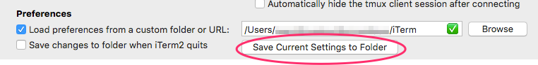

# OsX Installation Instruction

## Preparation

### Priority Apps:
These apps should be manually installed asap because I use them for my entire installation process:

  * [Chrome](https://www.google.com/chrome/browser/desktop/index.html)
  * [DropBox](https://www.dropbox.com/)
  * [Quiver](https://itunes.apple.com/fr/app/quiver-programmers-notebook/id866773894?mt=12)
  * [Sublime](https://www.sublimetext.com/)

### Chrome account Sync
Login with your user to sync apps, bookmarks and settings.
In case you don't like syncing with google you can just: 

  * retrieve everything 
  * export the bookmarks somewhere 
  * change user
  * import the bookmarks back
  * delete the google user

### iterm 

#### sync and settings

+ Theme:
    + download and extract [Solarized Dark Theme](http://ethanschoonover.com/solarized)
    + open `iterm2-colors-solarized` folder and  double click on `Solarized Dark.itermcolors`
    + open iterm `Preferences/Profiles/Colors/Load presets` and chose `Solarized Dark` color scheme (or your favorite theme)
+ Fonts for `powerline`
    + download and extract the [fonts for powerline](https://github.com/Lokaltog/powerline-fonts/archive/master.zip) 
    + drag the whole folder over `Font Book` application. This will install all the fonts system wide
    + open iterm `Preferences/ Profiles / Text /`
        + `Regular Font` and select `DejaVu sans mono 12pt for Powerline`
        + `Antialiased` and select `Inconsolata 12pt for Powerline`
+ Setup dropbox, then __Enable iterm2 sync options__:
    + Preferences / General / Preferences / Check "Load preferences from ..." / Browse / Chose the foolder (dropbox or others) where you saved your settings.     
    + __NOTE__: Anytime I change any settings I should click on "Save Current Settings ..."
    
+ Change the login shell
  * If you have installed bash 4 with `brew install bash` then you have to tell your mac this is your default shell, not the standard `/bin/bash`. one way to do this is to: `System Preferences / Users and Groups` then right click on your user (be sure to click the lock) and select `Advanced Options`. Under the `login shell` input paste the result of `which bash`. Restart iterm or the terminal app and you are done. 

#### shell integration
To enable [shell integration](https://www.iterm2.com/documentation-shell-integration.html) either you follow the default procedure by _iTerm2>Install Shell Integration_ or given that I've already installed it and added some extra utilities scripts you can just  open the file `~/.bash_local` and uncomment this line and you are ready to go:
```
  test -e "${HOME}/.iterm2_shell_integration.bash" && source "${HOME}/.iterm2_shell_integration.bash"
```
I source the iterm shell integration scipt from `.bash_local` because I do not want it on all my machines so by default it is disabled.
If you enable shell integration from `.bash_local` you will also get these cool commands (see the `~/iterm2` directory):
```
  cd ~/Pictures
  imgls                   # directory listing that includes a thumbnail of each image in a directory
  imgcat my_image.jpg     # Displays one or more images inline at their full size
  download file_name      # Downloads a file, but does not display it inline.
  divider my_image.jpg    # Draws a full-width, one line-tall graphical divider.
```
Check here https://www.iterm2.com/documentation-images.html for more docs.

### Get Xcode from App Store  
+ open xcode to agree to the TOS (or it won't install the components)  
+  install Command Line Tools: `xcode-select --install`  then click install  
+  open Xcode's preferences and install the command line tools package (this will install also git, from apple)  

### Bootable Backup (optional)
Right after a clean installation it's a good idea to crete a bootable backup on an external hard drive when the system is still clean.

+ Disk Utility / Erase or Partition / Mac Os Extended (Journaled)
  * Go to the (entire) hard disk section / select the partiton /
  * Be sure that it is "GUID Partition Table"
    - Otherwise / Options / Check GUID Partition Table
+ Backup Everything from the current hard disk to the external one with CCC

# Installation Steps

## Step 1: Install Homebrew and brew packages

I usually run step by step all the instruction in `./1.brew.sh` but the shortest way is to `sh 1.brew.sh`.  
This script will install:

* GNU replacement for various osx terminal commands
* Bash 4 
* Libraries 
* Bash completions
* Java (Oracle)
* PostgreSQL
* MySQL
* mod_wsgi

### PostgreSQL
    brew install postgresql
    initdb /usr/local/var/postgres -E utf8

### MYSQL
    brew install mysql
    # Or if you prefer mariadb 
    # brew install mariadb 
    # then also follow the instruction for setting up php.ini (under __apache__ section)
    unset TMPDIR
    export TMPDIR=/tmp
    mysqld --initialize-insecure --log-error-verbosity --user=`whoami` --basedir="$(brew --prefix mysql)" --datadir=/usr/local/var/mysql
For setup:

* launch mysql (I usually do so with [launchroket](https://github.com/jimbojsb/launchrocket))
* `mysql_secure_installation`
* `sudo cp $(brew --prefix mysql)/support-files/my-default.cnf /etc/my.cnf`


### Apache, mod_php and mod_wsgi 
`mod_php` is already installed (but not activated) `mod_wsgi` needs to be installed from brew.

#### mod_php
`cd /etc/apache2`  
`sudo vi httpd.conf`  
uncomment `# LoadModule php5_module libexec/apache2/libphp5.so`    
next find the `<IfModule dir_module>`, should be around the line 231 and substitute this block
    
    <IfModule dir_module>
        DirectoryIndex index.html
    </IfModule>
with
    
    <IfModule dir_module>
        DirectoryIndex index.html index.php
    </IfModule>
this tells apache to process `index.html` OR `index.php` if a directory is requested.  
Setup your `php.ini`

#### php.ini
`cd /etc/`  
`sudo cp php.ini.default php.ini`  

In case you installed and want to use _mariadb_ instead of _mysql_ then:
`sudo chmod +w php.ini`  
`sudo vi php.ini`    
> In php.ini, change the MySQL Unix socket (MariaDB installed by Homebrew use /tmp/mysql.sock by default). If php.ini copied from php.ini.default is not writable, make it writable then replace every occurence of /var/mysql/mysql.sock with /tmp/mysql.sock (it should be at two places)  
> <cite>[Credits](http://blog.manbolo.com/2013/05/02/build-and-deploy-a-django-project-on-osx-from-scratch#4)</cite>

Search for `;date.timezone = Europe/London` and uncomment it by removing the semicolon and add your timezone, for example: `date.timezone = Europe/London`. Then test apache and restart it:

`apachectl configtest`  
`sudo apachectl graceful`

##### Php built-in web server:
Php has a built-in development server, if you just want a basic local web server you can `cd mywebsite` and launch `php -S localhost:8000`
and access it at the address `http://localhost:8000`.   
Furthermore if you are using a php web framework, for example Silex, you can specify your application entry point (routing): `php -S localhost:8000 index.php`.   
In my `.bash_functions` there is a function called `server`, when I need a server on a directory, I just cd into it and launch `server` it will also open Chrome Canary (if installed) at the specified address or the default browser if Canary was not found.


#### mod_wsgi
    brew tap homebrew/apache
    brew install mod_wsgi
If problem in compiling see: https://github.com/Homebrew/homebrew-apache  
In short:
    
    $ sudo ln -s /Applications/Xcode.app/Contents/Developer/Toolchains/XcodeDefault.xctoolchain/ /Applications/Xcode.app/Contents/Developer/Toolchains/OSX10.9.xctoolchain
 edit `/etc/apache2/http.conf ` and add this:  
 `LoadModule wsgi_module /usr/local/Cellar/mod_wsgi/3.4/libexec/mod_wsgi.so` or the correct version you have in Cellar  
 Then test everything is ok:
 
    apachectl configtest   
    sudo apachectl restart  

#### mod_rewrite
Be also sure to uncomment `LoadModule rewrite_module libexec/apache2/mod_rewrite.so` in your `httpd.conf` file.   
Normally by default this line should be already uncommented but better to double check.  
`mod_rewrite` is what let you create websites with pretty URLs as for example applications like WordPress do.  
Open `/etc/apache2/httpd.conf` and look for all occurrences of  `AllowOverride None` and change them with `AllowOverride All` in the relevant places you want to make pretty urls. Then again:
    
    apachectl configtest   
    sudo apachectl restart  

### Turn off brew Analytics 
If you aren't aware brew is collecting [your usage data by default](https://github.com/Homebrew/brew/blob/master/share/doc/homebrew/Analytics.md).   
I don't like this, so: `brew analytics off`

## Step 2:  Install enviroments 

Run step by step or `sh 2.envs.sh`  
This script will install [rbenv](https://github.com/rbenv/rbenv), [pyenv](https://github.com/yyuu/pyenv) and [nvm](https://github.com/creationix/nvm) that means tools to easily switch version of Ruby, Python and Node.

### rbenv

#### Installation:
    brew install rbenv #for different versions of ruby
    brew install ruby-build

#### Usage:
    rbenv install -l        # list all the available versions of ruby to install
    rbenv install 2.1.2     # will install ruby 2.1.2
    rbenv global 2.1.2      # makes ruby 2.1.2 the default one
    rbenv rehash            # Run this command after you install a new version of Ruby, or install a gem that provides commands
__rbenv gemset__, for sandboxed collection of gems, for example for a specific project. SEE: https://github.com/jf/rbenv-gemset

    brew install rbenv-gemset
__specific_install__ to install gem from github (or anywhere else)
    
    gem install specific_install  # USAGE: gem specific_install -l <url to a github gem>

__Gemfile__

    gem install bundler
    rbenv rehash
    bundle install
This will create a `Gemfile.lock` file

### pyenv

#### Installation:
    brew install pyenv

#### Usage:
    pyenv install --list    # for the list of the available python version to install
    pyenv install 2.7.10    # install a specific version
    pyenv global 2.7.10     # set default global to be used in all shells by writing the version name to the 
    pyenv rehash            # to rebuild your shim files. Doing this on init makes sure everything is up to date 
    #
    pyenv versions          # list installed versions
    pyenv version           # current active version
    pyenv local 2.7.5       # set a python version for the current directory. It creates .python-version file inside the current directory
If everything is ok `which python` should prompt `/Users/USERNAME/.pyenv/shims/python` NOT `/bin/python`

#### virtualenvwrapper

    pip install virtualenv virtualenvwrapper    # If virtualenvwrapper wont work just uninstall and reinstall virtualenv
    brew install pyenv-virtualenvwrapper        # probably not needed

Then don't forget to source: `$(brew --prefix)/bin/virtualenvwrapper.sh`.   
    
    # create a virtualenv using the currently set global python
    mkvirtualenv my_venv1

    # for specific version of python (need to specify the full path)
    mkvirtualenv -p /Users/myuser/.pyenv/versions/2.6.6/bin/python2.6 my_venv2

### nvm

#### Installation:
I manage to manually install this, because the installation script write in my `.bashrc` (no, thanks).

    git clone https://github.com/creationix/nvm.git ~/.nvm && cd ~/.nvm && git checkout `git describe --abbrev=0 --tags`
    # Then source this from you .bash_profile
    source ~/.nvm/nvm.sh

#### [Usage](https://github.com/creationix/nvm#usage)

## Step 3: Install gloabl npm packages
Run step by step or `sh 3.npm.sh`  


## Step 4: Tools and Libraries
Run step by step or `sh 4.tools.sh`  
This will install:

* various global python libraries 
* lua packages 
* linters, useful for [Sublime Linter](https://github.com/SublimeLinter/SublimeLinter3) plugins
* [mackup](https://github.com/lra/mackup)
* [mert](https://github.com/eggplanetio/mert)
* [screengif](https://github.com/dergachev/screengif)
* Other things 

```bash
    # Python Packages for mysql and postgres
    export CFLAGS=-Qunused-arguments
    export CPPFLAGS=-Qunused-arguments
    pip install psycopg2 # postgres HAS to be installed
    
    pip install mysql-python
```


### Mert
[mert](https://github.com/eggplanetio/mert) is amazing! It is a command line tool for managing windows, tabs, and pane configurations for iTerm.

#### installation
    
    npm install -g mert


__Example__:

Run `mert init` in your project directory with, it will create a `.mertrc` file.  
Edit the `.mertrc` file:

    root: "/Users/foo/Projects/NonNewtonianApplesFallingUpwards"
    layout:
      -
        - workon foo_virtual_env; python manage.py runserver;
      -
        - cd webapp; gulp serve;
      -
        - git status;

then run `mert start`.  
This will read the `.mertrc` file and create 3 horizontal panes in iterm with your favorite commands for your project.  
I created an alias in `.bash_aliases`:

    alias start="mert start"
so that I just `cd myproject; start` will launch my defined panes and commands defined in the `.mertrc`. This saves me a lot of time!

### alcatraz
[alcatraz](http://alcatraz.io) packet manager for xcode. I don't have enough experience with this, I need to play with it a little bit more

    curl -fsSL https://raw.github.com/supermarin/Alcatraz/master/Scripts/install.sh | sh
    # uninstall with
    rm -rf ~/Library/Application\ Support/Developer/Shared/Xcode/Plug-ins/Alcatraz.xcplugin
    # Remove all cached data:
    rm -rf ~/Library/Application\ Support/Alcatraz

### mackup
Mackup sync app settings. I only use this for _better touch tool_ and _f.lux_ but can be used with almost any application.  
Open ~/.mackup.cfg and change the _directory_ to point to your dropbox (or whatever) where you saved your setting from another machine or osx installation. Then `mackup restore`.

#### Usage:
    mackup backup       # Launch it and back up your files
    mackup restore      # Launch it and restore your files
    mackup uninstall    # Copy back any synced config file to its original place.


## Step 5: Install applications with cask
"Homebrew [Cask](http://caskroom.io/) extends Homebrew and brings its elegance, simplicity, and speed to OS X applications and large binaries alike."
Basically I can install all my GUI application just by `sh 5.cask.sh` so I don't have to find each App homepage, download them, unzip, mount the dmg, drag and drop..I have so many apps that this task could take a lot of times. And most important I never remember all the apps I had previously installed.  

Casks comes with brew by default, to activate it, just: `brew tap caskroom/cask`.

To find an application:
    
    brew cask search chrome
will return a list with all matching applications.  
To install for example dropbox in `/Applications/Web` directory:
    
    brew cask install --appdir="/Applications/Web"    dropbox

I've created two aliases. In `.bash_aliases` 
    
    alias casksearch='brew cask search'
    alias caskinstall='brew cask install'

#### launchRocket
[LaunchRocket](https://github.com/jimbojsb/launchrocket) is a Mac PrefPane to manage all your Homebrew-installed services
    
    brew cask install launchrocket
This will make your life easier when you need to launch/stop/launch at startup services. For example you can handle `mysql` `mongodb`
`rabbitmq`, `postgresql` and so on..


### Manual Apps Installation
Make sure to go to pref panel/Security & Privacy: allows apps downloaded from anywhere.

#### Other Apps (low priority):
  * [Alfred2](https://www.alfredapp.com/help/v2/)
  * [Docker](https://www.docker.com/)
  * [LightRoom 6](https://www.adobe.com/products/catalog/software._sl_id-contentfilter_sl_catalog_sl_software_sl_mostpopular.html)
    - Then chose Buy/Upgrade and follow instructions
    - Add License
  * [SimpleMovieX](http://simplemoviex.com/SimpleMovieX/index.var)
  * [Apple Remote](https://itunes.apple.com/app/remote/id284417350?mt=8) 
  * [Video container switcher](http://sourceforge.net/projects/containerswitch/) GPL
  * [Pycharm](https://www.jetbrains.com/pycharm/) v.5.05 professional
  * [WebStorm](https://www.jetbrains.com/webstorm/) v.2016.1

#### App Store:
  * [ClearView](https://itunes.apple.com/fr/app/clearview/id557090104?l=en&mt=12)

#### Licenses:
Don't forget to add licenses for the following apps:

  * [Alfred2](https://www.alfredapp.com/help/v2/)
  * [Tower](https://www.git-tower.com/)
  * [Pycharm](https://www.jetbrains.com/pycharm/)
  * [WebStorm](https://www.jetbrains.com/webstorm/)
    - Mine is up to v.2016.1
  * [BetterTouchTool](https://www.boastr.net/)
  * [hyperdock](http://hyperdock.bahoom.com/get)
  * [Dash](https://kapeli.com/dash)
  * LightRoom


### Sytem Preferences

#### Language and Input Sources

+ System Preferences / Language & Region / 
  * Choose Preferred Languages
  * Keyboard Preferences / Input Sources / Choose Layouts:
    - U.S. Extended
    - U.S. International (for accents supports)
    - Italian or Whatever

#### Data Partition

I keep all my data in a separate partition. Music, Movies, Pictures, ectr BUT "Library" and of course the dotfiles.
Don't forget to symlink all the folders from external partiton to home:

  1. Copy/Paste the folder icons from home folders to external folders
  2. Erase home folders that exist on external hd
  3. Simlynk them: `cd ~/; ln -s /Volumes/HomeData/*/ .`  (ln is smart enough not to overwrite existing folder)
 

#### Add Spaces to Dock
```bash
  defaults write com.apple.dock persistent-apps -array-add '{"tile-type"="spacer-tile";}' 
  killall Dock
```

#### Enable double tap-dragging for touchpad
System Preferences / Accessibility / Mouse and trackpad / Trackpad options/ Enable dragging

#### Setup Global Hotkeys 
TODO: add images.
System Preferences / Keyboard / Shortcuts / ...

#### Reduce transparency in El Capitan
System Preferences / Accessibility / Display / Reduce Transparency

#### Always show Scrollbars
System Preferences / General / Show Scroll Bars -> Always

#### System Lock

  * System Preferences /
    - Security / Require pass immediately ...
    - Security / Disable Automatic Login
    - Desktop & Screen Saver / Screen Saver / Start After X minutes

#### Trim Support
If you have a non-Apple ssd Hard Drive it's a good idea to enable Trim Support: `sudo trimforce enable`
